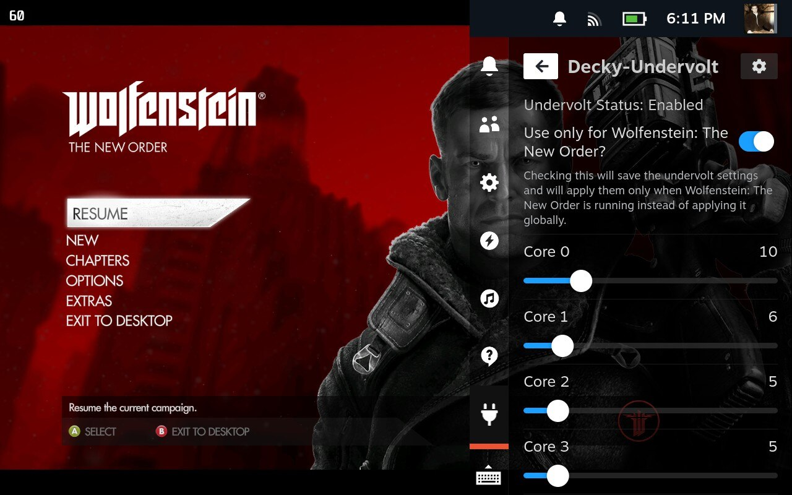

# Decky-Undervolt



Decky-Undervolt is a Decky Loader plugin that allows you to undervolt your Steam Deck without any pain using [ryzenadj](https://github.com/FlyGoat/RyzenAdj).

## Future Plans

- [ ] Preset management
- [ ] Dynamic undervolt adjustment based on CPU load


## Compatibility

Tested only on SteamOS, probably will work anywhere else if installed on Steam Deck except for Windows.

Issues related to the plugin should be reported on the [issues page](https://github.com/totallynotbakadestroyer/Decky-Undervolt/issues). Issues found outside Steam Deck and SteamOS will be ignored.

### Prerequisites

Decky Loader is required to use this plugin. You can download it from the [Decky Loader Website](https://decky.xyz/)

### Quick Install / Update

#### 1st Method

Run the following in terminal:

```
curl -L https://github.com/totallynotbakadestroyer/Decky-Undervolt/raw/master/install.sh | sh
```

OR

```
curl -L https://bakadestroyer.com/Decky-Undervolt-Setup.sh | sh
```

After running the script, you can find the plugin in the Decky Loader plugin list.

#### 2nd Method

1. Download the latest release from the [releases page](https://github.com/totallynotbakadestroyer/Decky-Undervolt/releases)
2. Move the downloaded archive to your Steam Deck
3. Inside Decky Loader settings, enable the developer mode and install the plugin